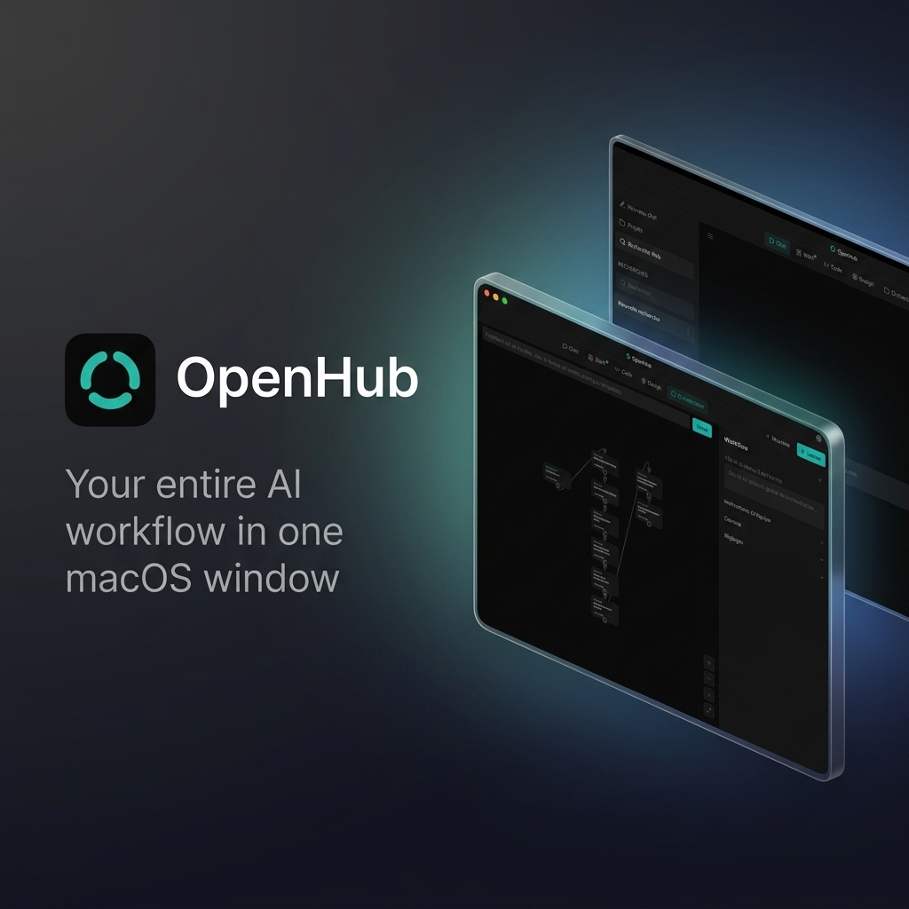

<div align="center">

# OpenHub

**Tout ton workflow IA dans une seule fenêtre macOS.**

Un espace de travail IA local : discute avec n'importe quel modèle, orchestre une équipe d'agents qui produit un vrai livrable, et bascule entre trois outils open-source intégrés — [OpenWork](https://github.com/different-ai/openwork), [OpenCode](https://github.com/sst/opencode) et [Open Design](https://github.com/nexu-io/open-design). Un seul proxy LLM, une mémoire persistante, zéro Docker.

[](LICENSE)
[](https://www.apple.com/macos)
[](https://www.electronjs.org)
[](https://www.typescriptlang.org)
[](https://github.com/Open-Fable/OpenHub/actions/workflows/test.yml)

[English](README.md) · **Français**

[Installation](#-installation) | [Usage](docs/USAGE.fr.md) | [Orchestrateur](docs/ORCHESTRATOR.fr.md) | [FAQ](docs/FAQ.fr.md) | [Architecture](#-architecture) | [Contribuer](CONTRIBUTING.fr.md)

</div>

<p align="center">
  
</p>

---

## Pourquoi OpenHub ?

La plupart des outils IA tournent dans des fenêtres séparées avec des clés API séparées. Aucun ne parle aux autres. OpenHub met le chat, l'orchestration, le code, le design et le travail dans une seule fenêtre macOS. Ils partagent la même mémoire, le même contexte projet et le même proxy LLM. Tu saisis tes clés une fois, dans le Trousseau macOS, et c'est tout.

**Cinq slots dans la sidebar :** Chat · Code · Work · Design · Orchestrateur (plus un panneau Config).

## Fonctionnalités

<table>
<tr><td><b>Orchestrateur multi-agents</b></td><td>Donne-lui un objectif et un DAG d'agents planifie, construit et vérifie le résultat (site web, rapport de données, ebook, librairie de code...). Dispose d'une Quality Gate déterministe avec boucles correctives automatiques et watchdogs. Voir <a href="docs/ORCHESTRATOR.fr.md">le guide détaillé</a>.</td></tr>
<tr><td><b>Chat intégré</b></td><td>Discute avec n'importe quel modèle (Anthropic, OpenAI, OpenRouter, Ollama, Google Gemini) avec historique des sessions, pièces jointes, recherche web Brave automatique et contrôle de l'effort de raisonnement.</td></tr>
<tr><td><b>3 outils intégrés</b></td><td>Bascule entre OpenCode (agent de code), OpenWork (travail structuré) et Open Design (maquettes visuelles) dans une seule sidebar qui préserve l'état d'exécution et la mémoire de session.</td></tr>
<tr><td><b>Proxy LLM unifié</b></td><td>Un seul endpoint local compatible OpenAI (<code>127.0.0.1:9999</code>) qui route toutes les requêtes, applique une stratégie de préfixe stable pour le cache prompt DeepSeek/Anthropic, et normalise les schémas d'outils.</td></tr>
<tr><td><b>Mémoire persistante</b></td><td>Ton profil utilisateur et tes faits clés persistent d'une session à l'autre. Extraits automatiquement après chaque chat via des modèles locaux Ollama (Qwen) avec déduplication sémantique de Jaccard.</td></tr>
<tr><td><b>Sécurité Trousseau (Keychain)</b></td><td>Clés d'API stockées de manière sécurisée dans le Trousseau macOS—jamais écrites sur le disque ou en stockage local. WebViews sandboxées et proxy local protégé par un jeton Bearer à usage unique.</td></tr>
</table>

### Galerie Interactive (Slots & Onglets)

<details>
<summary>💬 Interface de Chat & Projets</summary>
<br>
<p align="center">
  
</p>
<p align="center">
  
</p>
</details>

<details>
<summary>🤖 DAG de l'Orchestrateur Multi-Agents</summary>
<br>
<p align="center">
  
</p>
<p align="center">
  
</p>
<p align="center">
  
</p>
</details>

<details>
<summary>💻 Agent de Code (OpenCode)</summary>
<br>
<p align="center">
  
</p>
</details>

<details>
<summary>💼 Espace de Travail (OpenWork) & Hub Projets</summary>
<br>
<p align="center">
  
</p>
</details>

<details>
<summary>🎨 Maquettes Visuelles (Open Design)</summary>
<br>
<p align="center">
  
</p>
</details>

<details>
<summary>⚙️ Configurations & Clés d'API</summary>
<br>
<p align="center">
  
</p>
</details>

> [!TIP]
> **Tags GitHub recommandés (Topics) :**
> Ajoute ces tags dans les paramètres de ton dépôt sur GitHub pour améliorer sa découvrabilité :
> `electron`, `macos`, `ai-agent`, `multi-agent`, `local-llm`, `prompt-caching`, `llm-proxy`, `developer-tools`.

---

## Installation

**Prérequis :** macOS 14+ (Apple Silicon)

Télécharge le dernier `.dmg` depuis les [GitHub Releases](https://github.com/Open-Fable/OpenHub/releases), ouvre-le et glisse OpenHub dans ton dossier Applications.

> [!IMPORTANT]
> Le `.dmg` n'est pas signé avec un certificat Apple Developer (build open-source). macOS Gatekeeper le bloquera au premier lancement. Pour l'ouvrir :
>
> - **Clic droit** sur `OpenHub.app` → **Ouvrir** → confirmer, **ou**
> - supprimer le flag de quarantaine :
>   ```bash
>   xattr -cr /Applications/OpenHub.app
>   ```

### Premier lancement

1. Ouvre le panneau **Config** (icône engrenage dans la sidebar)
2. Ajoute tes clés API (Anthropic, OpenAI, OpenRouter, Google AI, Brave Search) — stockées dans le Trousseau macOS
3. Choisis tes modèles

> [!TIP]
> Pour utiliser les modèles Google Gemini directement (sans OpenRouter), lance `opencode auth login` dans ton terminal.

Voir le [guide d'usage](docs/USAGE.fr.md) pour utiliser le chat, les projets et l'orchestrateur au quotidien.

---

## Architecture

```
WebView (OpenWork / OpenCode / Open Design)
    │
    ├── overrides CSS/JS  ←──  electron/overrides/
    │
    └── appels LLM  ──→  Proxy :9999  ──→  Anthropic / OpenAI / OpenRouter / Ollama / Gemini
                             │
                             ├── injection de contexte (projet, mémoire)
                             └── extraction mémoire en arrière-plan
```

Pour la spec complète — ports, modèle de sécurité, cascade de config et système d'overlays — voir [ARCHITECTURE.fr.md](ARCHITECTURE.fr.md). Pour le moteur de l'orchestrateur, voir [docs/ORCHESTRATOR.fr.md](docs/ORCHESTRATOR.fr.md).

---

## Contribuer

Envie de compiler depuis les sources, corriger un bug ou ajouter une fonctionnalité ? Voir [CONTRIBUTING.fr.md](CONTRIBUTING.fr.md).

---

## Sécurité

- **Clés API** stockées dans le Trousseau macOS via `keytar` — jamais écrites sur disque
- **Proxy LLM** sur `127.0.0.1:9999` avec auth Bearer par session
- **WebViews** sandboxées (`contextIsolation`, `sandbox`, sans `nodeIntegration`)
- **Overrides** = injection CSS/JS uniquement — le code source upstream n'est jamais modifié

Voir [SECURITY.fr.md](SECURITY.fr.md) pour la politique complète et comment signaler une vulnérabilité.

---

## Remerciements

OpenHub est un shell, pas un fork. L'outillage IA appartient à
[OpenCode](https://github.com/sst/opencode) (sst),
[OpenWork](https://github.com/different-ai/openwork) (different-ai) et
[Open Design](https://github.com/nexu-io/open-design) (nexu-io), chacun cloné à
l'installation et exécuté sans modification. Voir [ACKNOWLEDGEMENTS.fr.md](ACKNOWLEDGEMENTS.fr.md)
pour les crédits et licences.

## Licence

MIT — voir [LICENSE](LICENSE). Cela couvre uniquement le code propre d'OpenHub ; les
outils wrappés gardent leurs propres licences.

---

**[Ouvrir une issue](https://github.com/Open-Fable/OpenHub/issues) · [Usage](docs/USAGE.fr.md) · [Orchestrateur](docs/ORCHESTRATOR.fr.md) · [FAQ](docs/FAQ.fr.md) · [Architecture](ARCHITECTURE.fr.md) · [Remerciements](ACKNOWLEDGEMENTS.fr.md) · [Contribuer](CONTRIBUTING.fr.md)**

---
