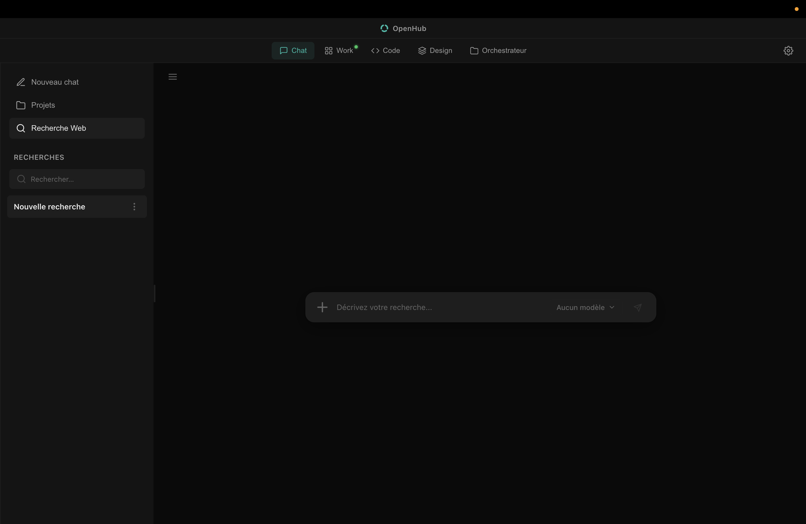
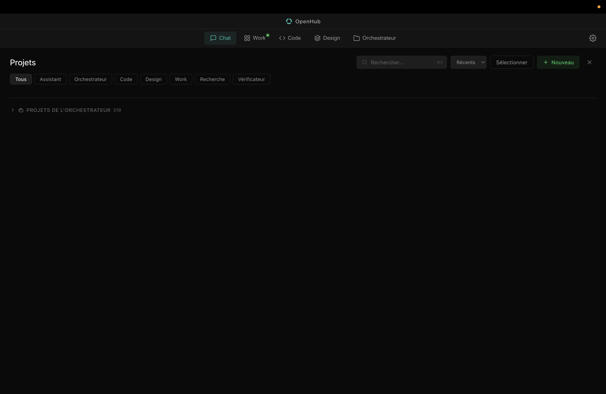
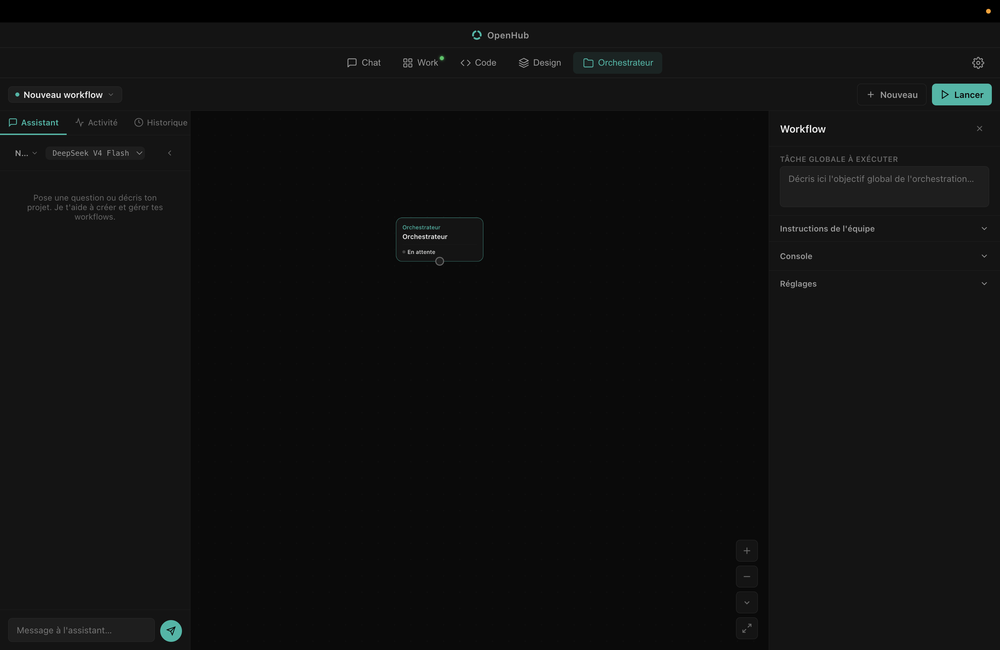
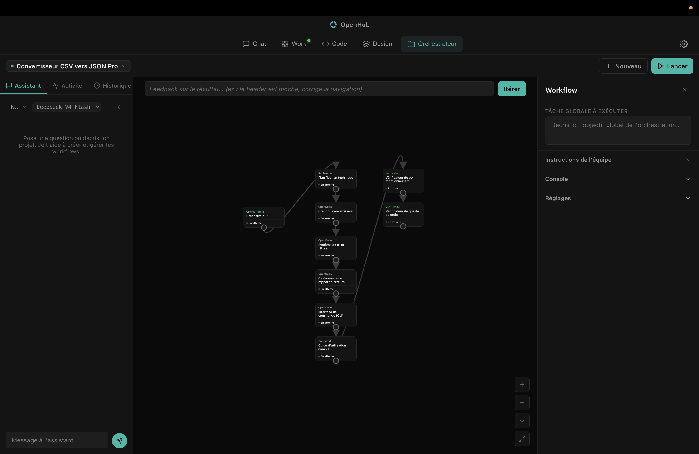
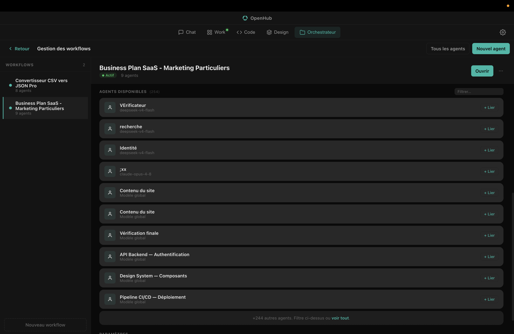
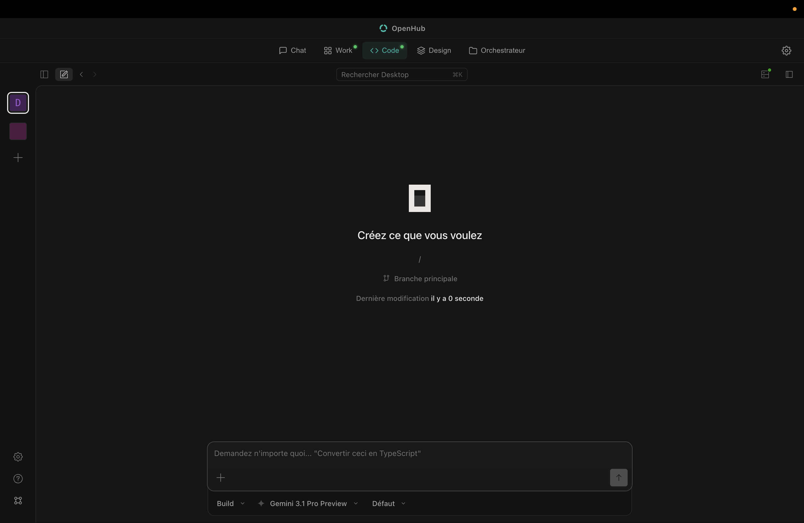
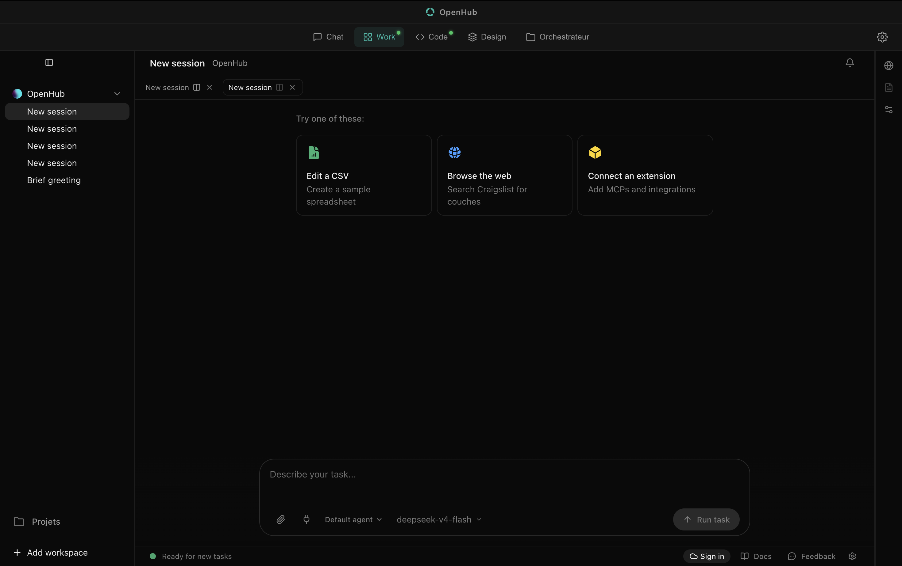
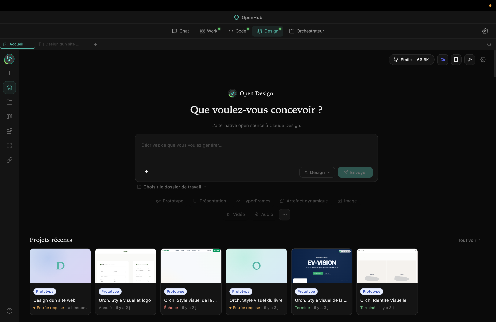
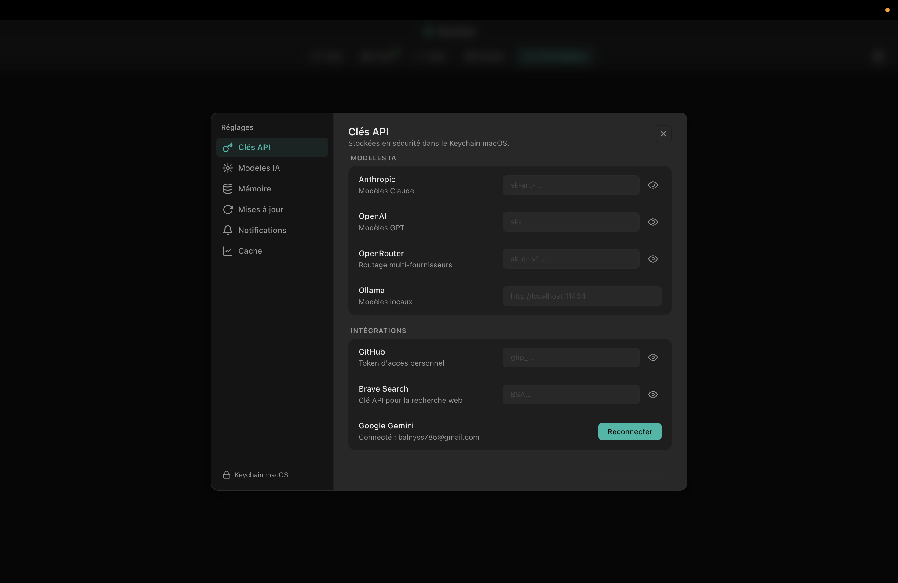

<div align="center">

# OpenHub

**Your entire AI workflow in one macOS window.**

A local AI workspace: orchestrate a team of agents that builds real deliverables and chat with any model across three integrated tools — [OpenWork](https://github.com/different-ai/openwork), [OpenCode](https://github.com/sst/opencode), and [Open Design](https://github.com/nexu-io/open-design). One LLM proxy, persistent memory, no Docker.

[](LICENSE)
[](https://www.apple.com/macos)
[](https://www.electronjs.org)
[](https://www.typescriptlang.org)
[](https://github.com/Open-Fable/OpenHub/actions/workflows/typecheck.yml)
[](https://github.com/Open-Fable/OpenHub/actions/workflows/lint.yml)
[](https://github.com/Open-Fable/OpenHub/actions/workflows/test.yml)

**English** · [Français](README.fr.md)

[Installation](#-installation) | [Usage](docs/USAGE.md) | [Orchestrator](docs/ORCHESTRATOR.md) | [FAQ](docs/FAQ.md) | [Architecture](#-architecture) | [Contributing](docs/CONTRIBUTING.md)

</div>

<p align="center">
  
</p>

---

## Why OpenHub?

AI tools are silos. They run in separate apps with their own API keys and memory. Nothing carries over when you switch windows. OpenHub puts five tools in one macOS window — shared memory, shared project context, a single LLM proxy. Keys are encrypted to `~/Library/Application Support/openhub/secrets.enc` once. That's it.

**Five sidebar slots:** Chat · Code · Work · Design · Orchestrator (plus a Config panel).

## Features

The **multi-agent orchestrator** is the headliner. Give it a goal — build a site, generate a data report — and a DAG of agents plans and builds the result, then verifies it. There's a deterministic Quality Gate with automatic corrective loops and watchdogs that keep the output from going off the rails. [Deep dive here.](docs/ORCHESTRATOR.md)

The **chat** works with Anthropic, OpenAI, OpenRouter, Ollama, or Google Gemini. Session history, file attachments, automatic Brave search, reasoning controls. Pick a model and go.

You get **three tools** in the sidebar: OpenCode (code-agent server), OpenWork (structured project workspace), and Open Design (visual mockups). Switch between them freely — execution state and session memory stay intact.

Behind the scenes, a **single LLM proxy** at `127.0.0.1:9999` routes everything through one OpenAI-compatible endpoint. It handles DeepSeek and Anthropic prompt caching via a Stable Prefix Strategy and normalizes tool schemas — the apps don't step on each other.

Your **profile and key facts** carry over between sessions. The system extracts them automatically after each chat using local Ollama models (Qwen) with Jaccard semantic deduplication.

**Security**: API credentials are encrypted to `~/Library/Application Support/openhub/secrets.enc` (AES-256-GCM). WebViews are sandboxed with localhost-only Bearer auth.

### Screenshots

<details>
<summary>What the chat slot looks like</summary>
<br>
<p align="center">
  
</p>
<p align="center">
  
</p>
</details>

<details>
<summary>Orchestrator in action — planning, building, verifying</summary>
<br>
<p align="center">
  
</p>
<p align="center">
  
</p>
<p align="center">
  
</p>
</details>

<details>
<summary>Code agent (OpenCode)</summary>
<br>
<p align="center">
  
</p>
</details>

<details>
<summary>OpenWork workspace and project hub</summary>
<br>
<p align="center">
  
</p>
</details>

<details>
<summary>Visual mockups in Open Design</summary>
<br>
<p align="center">
  
</p>
</details>

<details>
<summary>Config panel and API key management</summary>
<br>
<p align="center">
  
</p>
</details>

---

## Installation

**Requirements:** macOS 14+ (Apple Silicon)

Grab the latest `.dmg` from [GitHub Releases](https://github.com/Open-Fable/OpenHub/releases), open it, and drag OpenHub to your Applications folder.

> [!IMPORTANT]
> The `.dmg` isn't signed with an Apple Developer certificate (open-source build). macOS Gatekeeper will block it on first launch. To open it:
>
> - **Right-click** `OpenHub.app` → **Open** → confirm, **or**
> - clear the quarantine flag:
>   ```bash
>   xattr -cr /Applications/OpenHub.app
>   ```

### First launch

1. Open the **Config** panel (gear icon in the sidebar)
2. Add your API keys (Anthropic, OpenAI, OpenRouter, Google AI, Brave Search) — encrypted to `~/Library/Application Support/openhub/secrets.enc`
3. Pick your models

> [!TIP]
> To use Google Gemini models directly (without OpenRouter), run `opencode auth login` in your terminal.

See the [Usage guide](docs/USAGE.md) for the day-to-day.

---

## Architecture

```
WebView (OpenWork / OpenCode / Open Design)
    │
    ├── CSS/JS overrides  ←──  electron/overrides/
    │
    └── LLM calls  ──→  Proxy :9999  ──→  Anthropic / OpenAI / OpenRouter / Ollama / Gemini
                             │
                             ├── Context injection (project, memory)
                             └── Background memory extraction
```

Full spec — ports, security model, config cascade, overlay system — in [ARCHITECTURE.md](ARCHITECTURE.md). Orchestrator engine in [docs/ORCHESTRATOR.md](docs/ORCHESTRATOR.md).

---

## Contributing

Build from source, fix a bug, add a feature — see [docs/CONTRIBUTING.md](docs/CONTRIBUTING.md).

---

## Security

- Keys are encrypted to `~/Library/Application Support/openhub/secrets.enc` (AES-256-GCM).
- The proxy runs on `127.0.0.1:9999` with per-session Bearer auth.
- WebViews are sandboxed: `contextIsolation`, `sandbox`, no `nodeIntegration`.
- Overrides are CSS/JS only — upstream source stays unmodified.

Full policy and how to report a vulnerability: [docs/SECURITY.md](docs/SECURITY.md).

---

## Acknowledgements

OpenHub is a shell, not a fork. The AI tooling belongs to
[OpenCode](https://github.com/sst/opencode) (sst),
[OpenWork](https://github.com/different-ai/openwork) (different-ai), and
[Open Design](https://github.com/nexu-io/open-design) (nexu-io) — each cloned at install
time, run unmodified. See [docs/ACKNOWLEDGEMENTS.md](docs/ACKNOWLEDGEMENTS.md).

## License

MIT — see [LICENSE](LICENSE). Covers OpenHub's own code only; the bundled tools
keep their own licenses.

---

**[Open an issue](https://github.com/Open-Fable/OpenHub/issues) · [Usage](docs/USAGE.md) · [Orchestrator](docs/ORCHESTRATOR.md) · [FAQ](docs/FAQ.md) · [Architecture](ARCHITECTURE.md) · [Acknowledgements](docs/ACKNOWLEDGEMENTS.md) · [Contribute](docs/CONTRIBUTING.md)**

---
